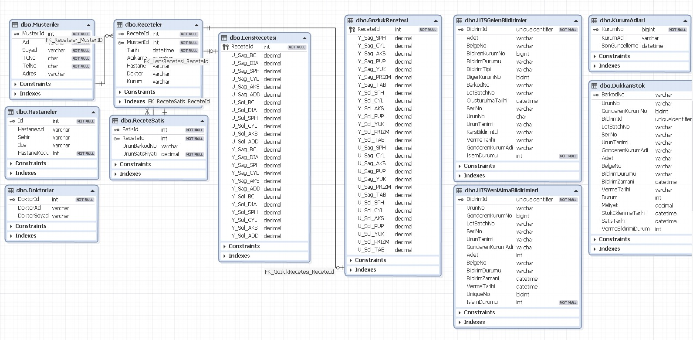
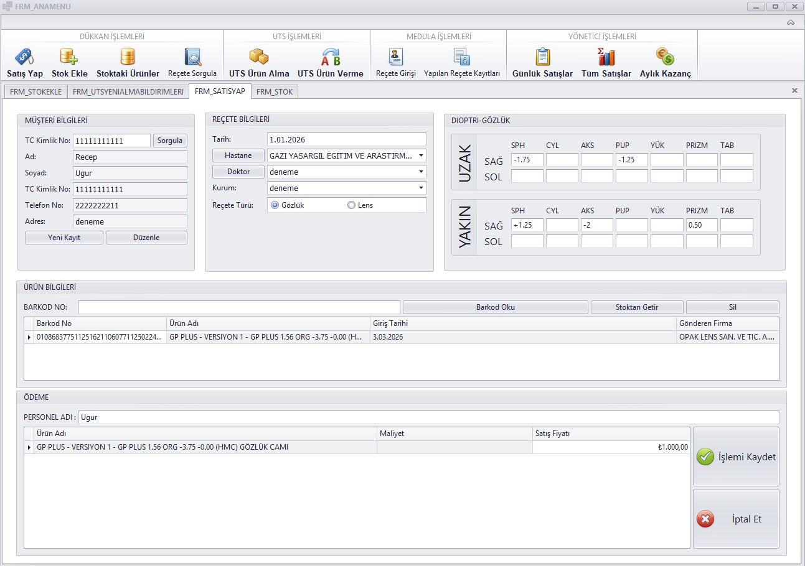
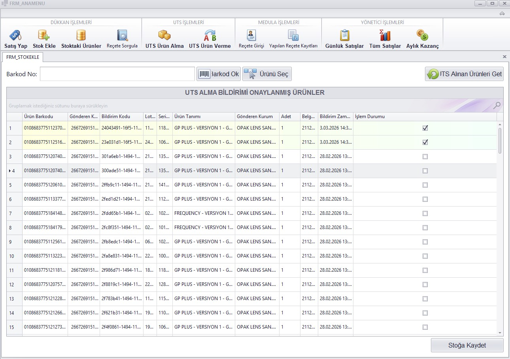
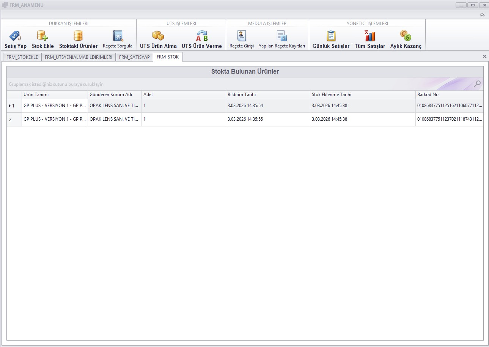
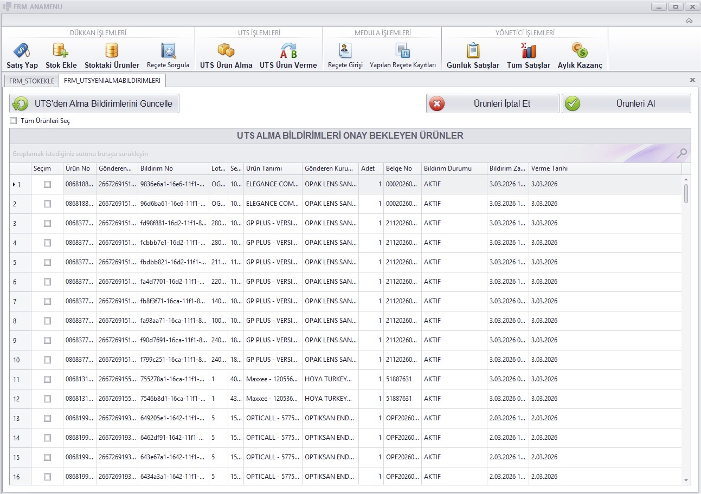
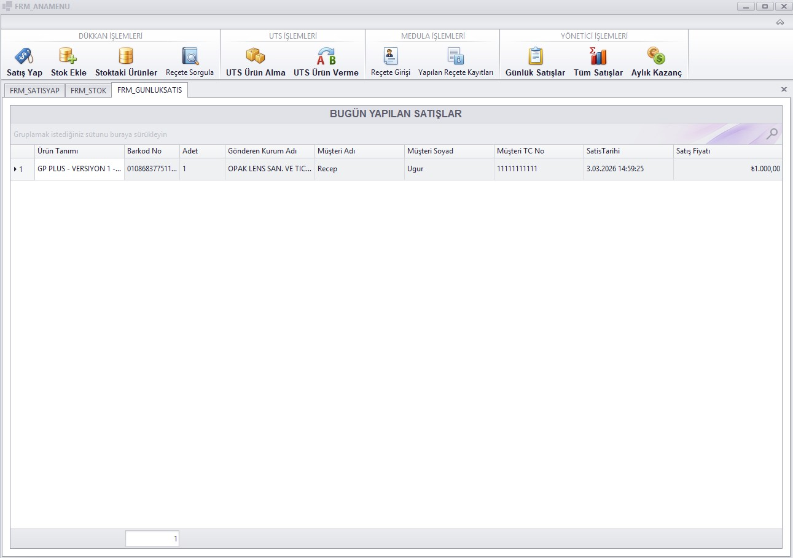
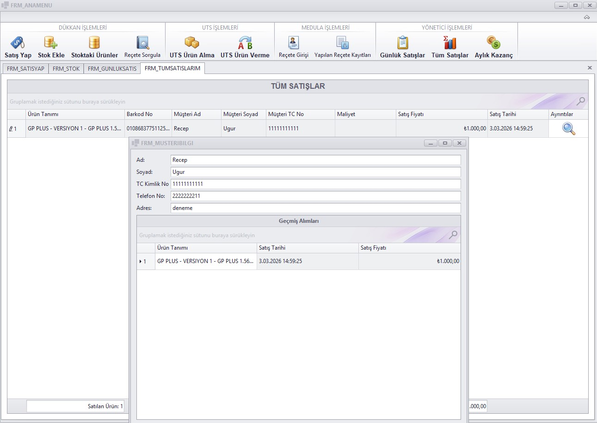

# Optik Takip Sistemi

Bu proje, optik mağazaları için geliştirilmiş kapsamlı bir müşteri, reçete, stok ve UTS (Ürün Takip Sistemi) bildirim yönetim sistemidir. C# ve DevExpress kullanılarak geliştirilmiş olup, veritabanı altyapısı Docker üzerinde çalışan MSSQL Server ile modernize edilmiştir.

## Teknolojiler
* **Language:** C# (.NET)
* **Interface (GUI):** Windows Forms & DevExpress Bileşenleri
* **Database:** MSSQL Server 2022
* **Container:** Docker & Docker Compose

## Ekran Görüntüleri ve Şema

### Veritabanı Mimarisi (ER Diyagramı)


### Uygulama Arayüzü
*Aşağıdaki görseller uygulamanın temel modüllerini göstermektedir:*








## Kurulum ve Çalıştırma (Geliştiriciler İçin)

Projeyi kendi bilgisayarınızda çalıştırmak için bilgisayarınızda **Docker Desktop** ve **Visual Studio 2022** kurulu olmalıdır. Veritabanı kurulumu için bilgisayarınıza SQL Server kurmanıza gerek yoktur, veritabanı bağlantısı docker üzerinden sağlanacaktır.

### 1. Veritabanını Ayağa Kaldırmak
Proje klasöründe bir terminal (PowerShell veya CMD) açın ve aşağıdaki komutu çalıştırarak SQL Server konteynerini başlatın:

```powershell
docker-compose up -d
```
Konteyner çalıştıktan sonra, projedeki kurulum.sql dosyasını kullanarak tabloları oluşturmak için şu komutu çalıştırın;

```powershell
docker exec -it OptikDb /opt/mssql-tools18/bin/sqlcmd -C -S localhost -U SA -P "Deneme1234." -i /var/opt/mssql/backup/kurulum.sql
```

Sonrasında src/Optik Takip Sistemi.sln ile projeyi çalıştırabilirsiniz.
> **ÖNEMLİ NOT:** Projenin UTS (Ürün Takip Sistemi) modüllerinin sorunsuz çalışabilmesi için geçerli bir optik firmasına ait **UTS TOKEN** girişi yapılmalıdır. Aksi halde UTS ile haberleşen sayfalarda API hataları alınacaktır.

